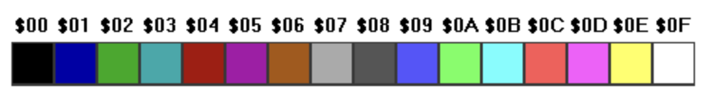

# Flag Quiz

## Release notes

```
Flag Quiz by ern0/Abaddon, a 256-byte DOS game
Released at [XXXX party, 2025.xx.xx](https://party/#TODO)


Features:
- quiz game
- 17 flags
- playable web version
- clean code
- AI analyses

Source code and AI analyses available:
https://github.com/ern0/256byte-flagquiz
```

## Play now!

You can [play it in browser](https://linkbroker.hu/stuff/flagquiz/) (powered by [JS-DOS](https://js-dos.com/)).

## Motivation

I wanted to make something that doesn't exist yet.
I think, the combination of the following requirements
meets the criteria:

- 256-byte
- game
- with database,
- written in clean code assembly.

I also wanted to know how well AI tools understand assembly code. Spoiler: they've done a pretty good job. [Check results here!](ai/README.md)

## The idea

### Country flags

I'm always looking for ideas for 256-byte intros,
and somehow I noticed that
most of the country flags are not tricolor,
as I had assumed.
Even fewer horizontal striped tricolor flags exist.
Some of these also have stripes of unequal height (Spanish).

Number of flags remaining: 17.
Great number,
big enough to not be boring and
small enough to fit data in 256 bytes.

### Guess game

Guess what game you can make with flags: guessing game.

It's obvious that
the names of countries should be given with TLD.
After a very brief analysis,
I have come to the conclusion that
TLDs were created for this very purpose:

- the input routine is very simple (it seemed so at the time),
- the evaluation of the answers is straightforward,
  a flag has exactly one TLD associated with it,
  which cannot be entered in different forms,
- little data to store,
- very little data to compare (a single 16-bit CMP does the job).

## The concept

### Drawing flags

The horizontally equally striped tricolor flags are very easy to draw,
we don't even need to use a graphics screen,
the PC's character set contains a filled square.

The EGA/VGA palette contains all the colors we need,
only _cyan_ and _purple_ are unnecessary.



### Flag data

Out of the 16 colors in the palette,
we only need only 8, the lighter ones.
Luckily the "light black" is still dark enough to use in flags,
but it still contrasts with the black background.
Great!

I've tried everyting, but eventually I realised that
I had to use 3 bits for one colour,
9 bits for a flag.

As the TLD data is ASCII lowcase letters,
there's plenty of room to store that 1 bit.

### TLD data

TLDs are 2 lower case letters.
There are 26 letters in the alphabet,
they can stored on 5 bits,
so the flag and TLD data should be 9 + 10 = 19 bits.
Let's calculate how many bytes we need for the data:

- If we pack the data bits,
  we need 17 * 18 = 306 bits,
  which is 39 bytes.
- If we use 2 bytes for the TLD,
  and we merge the 1 bit from the 9-bit color
  into one of the TLD bytes,
  we need 17 * 24 = 408 bits,
  which is 51 bytes.

The difference is 102 bits = 13 bytes,
which is practically 5-6 extra instructions,
I'm sure this is not enough for
extra code needed for bit shifting,
and I also wanted to keep the code clean,
so I let go the idea of packing.

### Keyboard input

For keyboard input I chose
`mov ah,01H / int 21H`.
It echoes the character entered,
even it handles backspace. Almost.

- As we can't disable the echo for specific keys,
the backspace on the first position
must be corrected with printing a space,
so the position will be virtually unchanged.
- The backspace at the second position
must also be corrected. The DOS function
moves the cursor only one position to the left,
but does not delete the character,
so an extra space and backspace must be printed.

### Displaying result

The trick is that
the program doesn't tell you whether
the answer is correct or not,
in both cases it just prints the correct answer
next to the player's answer,
so there are no separate code and text
for the two cases.

The score is displayed in two ways.
In both cases, the initial state is stored and
the program changes it as the game goes.
Thus the quiz can only run once.

### No random order

The order of the questions is constant.
A random number generator,
which takes each item through in random order,
would have been difficult to implement.
And it's unnecessary.
Frankly,
who wants to play such a crappy game
more than once?

## Repository contents

### Source file

The main source file is [flagquiz.asm](flagquiz.asm).
It can be compiled,
but the result will be longer than 256 byte.

### Data generation

The [flagdata.inc](flag data include) is
generated by [generate.py](generate.py),
it also contains the data
in form of series of function calls:

```
self.flag("Germany", "de", BLACK, RED, YELLOW)
self.flag("France", "fr", BLUE, WHITE, RED)
  (...)
```

### Inliner

The [inliner.py](inliner.py) script takes the source,
and replaces subroutine calls with inline code,
where possible.
This mechanism was necessary to
keep the original source in clean code style
without exceeding the 256-byte limit.

### Preparing for AI analysis

The AI uses the clean code version of the program,
with the only changes that the comments are deleted,
the data is included, and also the
[prompt](ai/prompt-base.txt) is
[added](ai/prompt-full.txt).
See [Makefile](Makefile) for details.

### Preparing for web

[JS-DOS](https://js-dos.com/) requires
a [configuration](web/dosbox.conf) and
some packaging.
This is also controlled by [Makefile](Makefile).

---
